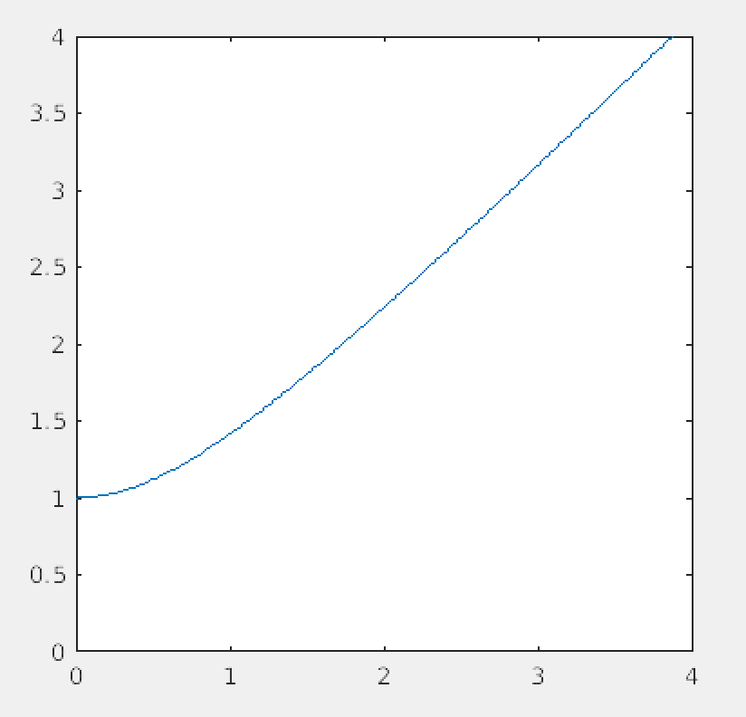
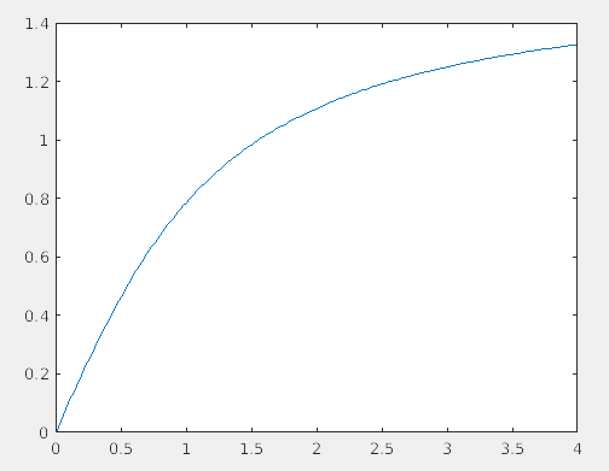

# [SE380: Introduction to Feedback Control Systems](https://uwflow.com/course/se380)
[notes on learn](https://learn.uwaterloo.ca/d2l/le/content/402630/fullscreen/2241439/View)

Course is about classical control; most prevalent, assumes linear and time invariant plant
- it requires that we have a transfer function
- when you use feedback, you need to consider the possibility of a system not converging

### Summary
- Complex Numbers
  - Euler's Identity: $e^{j\theta} = \cos(\theta) + j\sin(\theta)$ gives us a way to think about complex numbers in terms of angles
  - Polar form makes it easy to multiply/divide: $|z| = ℝ$ and $arg(z) = \theta$
    - arg is the principle argument (angle when in polar form)
  - Complex conjugate, $\bar{z}$ of the denominator for turning division into multiplication
    - $z\bar{z} = |z|^2$

Consider $f(\omega) = 1 + j\omega \in \mathbb{R} \Rightarrow \mathbb{C}$

1. $\lim_{\omega \rightarrow +-\inf} = +=\inf$ (vertically)
2. $f(0) = 1 \in \mathbb{R}$
3. $f(1) = 1 + j = \sqrt{2} e^{\frac{\pi}{4}j}$

Let's plot magnitude vs. omega. As $\omega \rightarrow \inf$, $angle(z) \rightarrow \frac{\pi}{2}$



Let's plot angle vs. omega. Note that at $\omega = 1, angle(\omega) \rightarrow \frac{\pi}{4}$



Notice this is like a bode plot. $f$ is our transfer function, and we've plotted two graphs again $\omega$

In lab 2, we looked at a second order circuit system.
- we can have second order LTI systems, it just means that the output signal depends on the input y(t) and both the first and second derivative of y(t)
- feeding the output back as input (closing the loop) decreases steady state gain of the system and damping ratio, and increases the bandwidth frequency and natural frequency
- closed-loop systems can handle disturbance signals while open-loop cannot

For sketching bode plots, the magnitude plot is on a scale of dB, so $20 \log|G(s)|$ for transfer function G(s). The phase plot is on a scale of degrees. The x axis is on a logarithmic scale. The sketch is called an asymptotic bode plot. We use straight line approximations to draw the plot.
- for magnitude, taking the log of a fractional expression allows us to rewrite it as a sum of logs (with negatives for denominator terms)
- use zeroes and poles to determine where the plot changes, and its coefficient is the slope of the linear approximation
- bandwidth of the transfer function can be determined by calculating at what frequency (x-axis) the dB drops by 3 from it's initial value
  - $20 log|G(s)| = K-3$, for some gain of $K$ *(K might be the wrong variable to use here)*

### [Introduction](http://davepagurek.github.io/SE-Notes/se380/01%20intro.html)
- u(t) is convention for control systems (control signal), effectively our algorithm
- r(t) is also convention, for reference signal
- open loop solution is missing feedback from y(t), so the algorithm cannot effectively make r(t) and y(t) converge
- simple closed loop algorithm:

```
// positive if too close, neg if too far
distance_adjustment = r(t) - y(t)
u(t) = -Kp * distance_adjustment
```

Better algorithm, we can add another term with an integral that effectively keeps a history of choices to better influence the velocity.


- Signals are functions of time, systems apply transformations on these functions

#### Design Cycle
1. Study the system to be controlled, decide on sensors and actuators. Sensors change what information is at your disposal, and actuators represent choices you can make in response to the inputs.
2. Model the resulting system
  - mathematical model
  - often one or more differential equations, obtained through analysis or experimental data
3. Simplify model if necessary
  - classical control (this course) deals with linear, time-invariant systems. It requires that we have a **transfer function** of the plant.
  - e.g. $\mathcal{L}\left\{\frac{dx_f}{dt}\right\} = \mathcal{L}\{u\} \Rightarrow sX_f(s) = U(s)$. Transfer function is $\frac{X_f(s)}{U(s)} = \frac{1}{s}$.
  - A system has a transfer function iff it is linear and time-invariant.
4. Analyze the resulting system
5. Determine specifications: stability, good steady-state behaviour, robustness, good transient performance
6. Decide on type of controller
7. Design the controller
  - In this course, the controller itself that we design will be a transfer function
  - This transfer function corresponds to a differential equation relating the inputs and outputs of the controller
8. Simulate (usually using Matlab)
9. Return to step 1 if neecessary
10. Implement controller
  - Realistically, the Ordinary Differential Equation (ODE) from step 7 is discretized and approximated as a difference equation and implemented in software

e.g. follower is $u(t) = -K_p (r(kT)-y(kT)), \quad kT \le t \lt (k+1)T$

### [Modelling](http://davepagurek.github.io/SE-Notes/se380/02%20modelling.html)
- for control design, we need a good mathematical model of a plant; simple but accurate
- design is simple but simulation we can use more complex


1. Apply known laws to get a system of differential equations
2. Linearize the model at an operating point to get a system of linear equations
3. Take the Laplace transform with zero initial conditions to get a system of linear algebraic equations
4. Isolate input and output to get a transfer function
5. Experimentally determine parameter values for the transfer function (e.g. weight of your robot)

#### Applying known laws to get equations
##### e.g. Spring


$q \in \mathbb{R}$ is the position of the mass M

$\dot{q} := \frac{dq}{dt}, \quad \ddot{q} := \frac{d^2q}{dt^2}$

Assume that $q=0$ corresponds to the mass location at which the spring is neither stretched nor compressed.

Newton's 2nd law: $F = ma$ or $M\ddot{q} = \sum{ \text{forces acting on } M}$

Force due to spring: $F_K(q) = Kq$, assumed to be linear

Force due to damper, possibly nonlinear: $C(\dot{q})$

Altogether, we get a second order nonlinear ODE:
$$M\ddot{q} = -Kq - C(\dot{q}) + u$$

Note: if the damper is linear ($C(\dot{q})=bq$), then the overall system is linear

##### e.g. Resistor


Non linear resistor just means it's a function that's non linear with respect to the current

$V_R(t) = h(i(t)), \quad h : \mathbb{R} \rightarrow \mathbb{R}$ is possibly nonlinear

$u(t)$: applied voltage; $y(t)$: voltage across capacitor

Apply Kirchoff's Voltage Law, recall that it states that conservation of energy holds for voltage in a circuit:
$$\begin{align}
-u(t) + V_R + y &= 0\\
\\
i(t) &= C\frac{dy}{dt} \quad \text{(capacitor equation)}\\
V_R &= h(i(t)) = h(C\dot(y))\\
\\
-u(t) + h(C\dot{y}) + y &= 0\\
\end{align}$$

Note: if the resister were linear ($h(i) = Ri$), the whole system would be linear (see 2.3.4 in notes)


**Observe that, no matter what you're trying to model, there are governing laws that define modelling in that domain**
- if you need more examples, 2.3 in the notes has many examples


#### State models
- State-space models are a way of expressing mathematical models in a standard form
  - the state-space's axes are the state variables
- the benefit is that the state variables are expressed as vectors, abstracted away from input, output and states
  - allow us to use linear algebra to solve

##### e.g. Cart


Newton's second law: $M\ddot{y} = u - D(\dot{y})$
- u is the vector of control inputs

We put this model into a standard form by defining two **state variables**:
$$x_1 := y \text{ (position)}, \quad x_2 := \dot{y} \text{ (velocity)}$$

Together, $x_1$ and $x_2$ make up the **state** of the system. We do some rewriting to have a systematic way to do linearization:

$$\begin{align}
\dot{x_1} &= x_2 & \text{(state equation)}\\
\dot{x_2} &= \frac{1}{M}u - \frac{1}{M}D(x_2) & \text{(state equation)}\\
y &= x_1 & \text{(output equation)}\\
\end{align}$$

Together, these equations make up the **state-space model.** These equations have the general form:

$$\dot{x} = f(x,u) \text{ where } y = h(x)$$

In this example:

$$\begin{align}
X &= (x_1, x_2) \in \mathbb{R}^2\\
f(x,u) &= \begin{bmatrix}
x_2 \\
\frac{1}{M}u - \frac{1}{M}D(x_2)
\end{bmatrix}\\
\end{align}$$
- X maps a scalar value to a two-tuple


When they're non-linear we can't say much, but in the special case where air resistance is a linear function of $x_2$ ($D(x_2)=d x_2$), then $f(x,u)$ becomes a linear function of $x$ and $u$:

$$f(x,u) = \begin{bmatrix}
0 & 1 \\
0 & \frac{-d}{M}
\end{bmatrix} \begin{bmatrix}
x_1 \\
x_2
\end{bmatrix} + \begin{bmatrix}
0 \\
\frac{1}{M}
\end{bmatrix} u
$$

Define $C = \begin{bmatrix}1 & 0\end{bmatrix}$. In the linear case, we get:
$$\begin{align}
\dot{x} &= Ax + Bu\\
y &= Cx\\
\end{align}$$

This is a linear, time-invariant (LTI) model.

**Expect at least one question like this on the midterm**

## Generalizing
Generalizing, an important class of systems have models of the form:

$$\begin{align}
\dot{x} &= f(x, u), & f: \mathbb{R}^n \times \mathbb{R}^m \rightarrow \mathbb{R}^n\\
y &= h(x, u), & h: \mathbb{R}^n \times \mathbb{R}^m \rightarrow \mathbb{R}^p\\
\end{align}$$

- This model is nonlinear
- there are $m$ control inputs $u=(u_1, ..., u_m)$
- there are $p$ outputs $y=(y_1,...,y_p)$
- the state vector $x$ has dimensions $n$: $x=(x_1, ..., x_n)$

The linear special case is:
$$\begin{align}
\dot{x} &= Ax + Bu, & A \in \mathbb{R}^{n \times m}\\
y &= Cx + Du, & C \in \mathbb{R}^{p \times m}\\
\end{align}$$

In this course, we look at single-input, single-output systems: $m=p=1$.

### e.g. more carts


$$\begin{align}
m&=2, & u &= (u_1, u_2)\\
p&=2, & y &= (y_1, y_2)\\
m&=4, & x &= (x_1, x_2, x_3, x_4) := (y_1, \dot{y_1}, y_2, \dot{y_2})\\
\end{align}$$

### e.g. drones

$$\begin{align}
u &= (y_1, u_2, u_3, u_4)= (f_1, f_2, f_3, f_4)\\
p&=3\\
y&=(y_1, y_2, y_3)\\
x &\in \mathbb{R}^{12} = (\text{position}, \text{orientation}, \text{velocity}, \text{angular velocity})\\
\end{align}$$

### Determining state
What is the state of a system?

The state vector $x(t_0)$ encapsulates all of the system's dynamics up to time $t_0$.

More formally: For any two times $t_0 \lt t$, knowing $x(t_0)$ and knowing $\{u(t) : t_0 \le t \lt t_1\}$, we can compute $x(t_1)$ and $y(t_1)$.

### e.g. cart with no forces


We know $M\ddot{y} = 0$ from Newton's laws.

If we try a 1-dimensional state, say $x := y$, then knowing $x(t_0)$ without knowing $\dot{y}$ is not enough information to find the position in the future, $x(t)$ for $t \gt t_0$. We have the same problem if we define $x = \dot{y}$.

Since the governing equation is second order, we need two initial conditions. So, $x=(y, \dot{y}) \in \mathbb{r}^2$ is a good choice.

In general, it is a good idea to use:
- position and velocity for a physical system
  - captures potential energy and kinetic energy respectively
- Capacitor voltage and inductor current for a circuit

### e.g. 2.5.2: Pendulum


Model: $\ddot{\theta} = \frac{3}{Ml^2} u - 3\frac{g}{l} \sin(\theta)$

In state space form:
$$\begin{align}
x &= (\theta, \dot{\theta})\\
y &= \text{angular position} = \theta\\
\\
\dot{x}&=f(x,u) \quad & & \dot{x_1}=x_2\\
\dot{y}&=h(x,u) \quad & & \dot{x_2}=\frac{3}{Ml^2}u - 3\frac{s}{l} \sin(x_1)\\
& & & y = x_1
\end{align}$$

- *written in terms of state (x's) and control input (u's)*

This is nonlinear due to the sine term.

### e.g. 2.4.5 Circuit


$$\begin{align}
x_1 &:= \text{voltage across capacitor} = \frac{1}{C} \int_{0}^{t}{y(\tau)d\tau}\\
x_2 &:= \text{current through inductor} = y\\
\\
-u + V_R + V_C + V_L &= 0\\
\Rightarrow -u + Rx_2  + x_1 + L\dot{x_2} &= 0,
\\
\\
\dot{x_1} &= \frac{1}{C}x_2(t)\\
\dot{x_2} &= \frac{-1}{L}x_1 - \frac{R}{L}x_2 + \frac{1}{L}u\\
y &= x_2\\
\\
\dot{x} &= \begin{bmatrix}
0 & \frac{1}{C}\\
\frac{-1}{2} & \frac{-R}{L}\end{bmatrix} \begin{bmatrix}x_1\\
x_2\end{bmatrix} + \begin{bmatrix}0 \\ \frac{1}{L}\end{bmatrix} u\\
\dot{x} &= \begin{bmatrix}
0 & \frac{1}{C}\\
\frac{-1}{2} & \frac{-R}{L}\end{bmatrix} \begin{bmatrix}x_1\\
x_2\end{bmatrix} + \begin{bmatrix}0 \\ \frac{1}{L}\end{bmatrix} u\\
y &= \begin{bmatrix}0 & 1\end{bmatrix}\\
\end{align}$$
- $y(t)$ is our output in amps, $u(t)$ is input, in volts
- *intuition said to choose capacitor and inductor for state variables (since they both depend on time, state)*
  - if there were not any capacitors or inductors, the system could not store state and would not be dynamic

recall that capacitors hold charge, that converges over time:


recall that inductors impede/release current over time:


### Overview
- examples should give you an idea of how to choose state variables
- these methods shown are to give us ways to solve dynamic questions, systems that hold state (energy)

## Linearization

This is the process of aproximating a nonlinear state-space model with a linear model.
- *when we linearize, we always need to pick a point that we're estimating at, can't make a linear estimate that's generally good*

### e.g. 2.5.2
Linearize $y=x^3$ at the point $\bar{x}=1$.


Let $\bar{y} := f(\bar{x}) = 1^3 = 1$

Taylor series at $x=\bar{x}$ is:
$$y=\sum_{n=0}^\infty c_n (x-\bar{x})^n, \quad c_n = \frac{1}{n!} \frac{d^n f(x)}{dx^n} \biggr|_{x=\bar{x}}$$
- *the constant depends on derivatives*
- *next, let's write this out explicitly*

$$\begin{align}
f(x) &= f(\bar{x}) + \frac{df(x)}{dx}\biggr|_{x-\bar{x}} (x-\bar{x}) + \text{higher order terms}\\
\text{Keep only the terms $n=0$ and $n=1$:}\\
f(x) &\approx f(\bar{x}) + \frac{df(x)}{dx}\biggr|_{x-\bar{x}} (x-\bar{x})\\
y - \bar{y} &\approx + \frac{df(x)}{dx}\biggr|_{x-\bar{x}} (x-\bar{x})\\
\end{align}$$
- *this looks like a linear equation!*

If we define the derivations $\partial y := y - \bar{y}, \partial x := x - \bar{x}$, then $\partial y = \frac{df}{dx} \bigg|_{x=\bar{x}} \partial x$, i.e. $\partial y = 3 \partial x$
- *evaluated at 1, for $x^3$*

### e.g. 2.5.3
$$y = \begin{bmatrix}y_1 \\ y_2\end{bmatrix} = f(x) = \begin{bmatrix}x_1 x_2 - 1 \\ x_3^2 - 2x_1 x_3\end{bmatrix} =: \begin{bmatrix}f_1(x) \\ f_2(x)\end{bmatrix}$$

Linearize at $\bar{x}=(1, -1, 2)$.

$\bar{y}=f(\bar{x})=\begin{bmatrix}-2\\0\end{bmatrix}$

## Multivariable Taylor series
$$d(x)=f(\bar{x})+\frac{\partial f}{\partial x} \biggr|_{x=\bar{x}} (x-\bar{x}) \text{ + higher order terms}$$

The Jacobian of $f$ at $\bar{x}$ is:
$$\begin{align}
\frac{\partial f}{\partial x} \biggr|_{x = \bar{x}}
&= \begin{bmatrix}
  \frac{\partial f_1}{\partial x_1} & \frac{\partial f_1}{\partial x_2} & \frac{\partial f_1}{\partial x_3} \\
  \frac{\partial f_2}{\partial x_1} & \frac{\partial f_2}{\partial x_2} & \frac{\partial f_2}{\partial x_3} \\
  \frac{\partial f_3}{\partial x_1} & \frac{\partial f_3}{\partial x_2} & \frac{\partial f_3}{\partial x_3} \\
\end{bmatrix}\\
&= \begin{bmatrix}
  x_2 & x_1 & 0 \\
  -2x_3 & 0 & 2x_3-2x_1 \\
\end{bmatrix}_{x=(1, -1, 2)}\\
&= \begin{bmatrix}
  -1 & 1 & 0\\
  -4 & 0 & 2
\end{bmatrix}\\
&= A
\end{align}$$

i.e. $y-\bar{y} \approx A(x-\bar{x})$
- *notice multivariate has the same benefits as single, we just get a linear mapping instead*

By extension, near $(x,u)=(\bar{x}, \bar{u})$:
$$f(x, u) \approx f(\bar{x}, \bar{u})+ \frac{\partial f}{\partial x} \biggr|_{(x,u)=(\bar{x}, \bar{u})} (x-\bar{x}) + \frac{\partial f}{\partial u} \biggr|_{(x,u)=(\bar{x}, \bar{u})} (u-\bar{u})$$

Let's apply this to $\dot{x}=f(x,u), y=h(x,u)$, *a dynamic system; non-linear state space model*

**Definition:** A constant pair $(\bar{x}, \bar{u}) \in \mathbb{R}^n \times \mathbb{R}^m$ is an **equilibrium configuration** of the system $\dot{x}=f(x,u), y=h(x,u)$ if $f(\bar{x}, \bar{u})=(0,...,0)$. The constant $\bar{x}$ is the **equilibrium point.**
- *system is at rest at $\bar{x}$ and $\bar{u}$, we'll always do linearization at an equalibrium configuration*

### 2.5.4 e.g. Find all the equilirium configurations at which the pendulum is upright


$$\begin{align}
\dot{x} &= f(x,u)\\
y &= h(x,u)\\
x_1 &= \theta\\
x_2 &= \dot{\theta}\\
f(x,u) &= \begin{bmatrix}x_2\\ \frac{3}{Ml}u-\frac{3g}{l}\sin(x_1)\end{bmatrix}\\
h(x) &= x_1
\end{align}$$

If $y=\pi$ (upright), then $\bar{x_1}=\pi$. So we have to solve:
$$
\begin{bmatrix}0\\0\end{bmatrix} = \begin{bmatrix}
  \bar{x_2}\\
  \frac{3\bar{u}}{Ml} - \frac{3g}{l}\sin(\bar{x_1})
\end{bmatrix} \Rightarrow \bar{x_2}=0, \quad \bar{u}=0
$$

- *(0,0,0...) the derrivatives vanish, so we solve for that*
- *if we start pendulum at upright, zero velocity, zero torque, our model says it won't move; it's at rest, and won't physically move based on our model*
- *same idea as before, but now x and u are a function of t, making it a dynamical system*

Therefore the equilibria are:
$$
\begin{bmatrix}\bar{x_1}\\\bar{x_2}\end{bmatrix} = \begin{bmatrix}\pi + 2\pi k \\ 0\end{bmatrix}, \quad \bar{u}=0
$$

Assume that $\dot{x}=f(x,u)$ (the nonlinear state-space model) has an equilibrium configuration at $(x,u)=(\bar{x}, \bar{u})$. *Forgetting about the higher order terms due to linearization,*

$$
f(x,u) \approx \underbrace{f(\bar{x}, \bar{u})}_{=0} + \underbrace{\frac{\partial f}{\partial x} \biggr|_{(x,u)=(\bar{x}, \bar{u})} (x - \bar{x})}_{=: A} + \underbrace{\frac{\partial f}{\partial u} \biggr|_{(x,u)=(\bar{x}, \bar{u})} (u - \bar{u})}_{=:B}$$

Consider deviations from $(\bar{x}, \bar{u})$, where $||\partial x||, ||\partial u||$ are assumed to be small:
$$\begin{align}
\partial x(t) &:= x(t) - \bar{x}\\
\partial u(t) &:= u(t) - \bar{u}\\
\end{align}$$
- this is the linearized model
- A and B are the linear approximations, that hold well when $\delta x$ and $\delta y$ are small

Then we get linearized state equations:
$$\dot{\partial x} = \dot{x} - 0 = f(x,u) \approx A\partial x + B \partial u\\
\dot{\partial x} = A\partial x + B\partial u$$

Linearized output equation:

$$\partial y = \underbrace{\frac{\partial h}{\partial x} \biggr|_{(x,u)=(\bar{x},\bar{u})} \partial x}_{=:C} + \underbrace{\frac{\partial h}{\partial u} \biggr|_{(x,u)=(\bar{x},\bar{u})} \partial u}_{=:D}\\
\partial y := y-\bar{y}=y-h(\bar{x},\bar{u})$$

- *together, A, B, C, D, characterize our linear state-space model*

### Summary
Linearizing $\dot{x}=f(x,u)$ and $y=h(x,u)$:

1. Select an equilibrium configuration $(\bar{x}, \bar{u}) \in \mathbb{R}^n \times \mathbb{R}^m$: $\bar{y}=h(\bar{x},\bar{u}), f(\bar{x},\bar{u})=0$, where all derivatives vanish
2. Compute Jacobians of $f,h$ to get $A,B,C,D$, *matrices have to be constants, no x's or u's*
3. Linearization: $\dot{\partial x} = A \partial + B \partial u, \partial y = C \partial x + D \partial u$

We do this to simplify our mathematical model, by finding a good linear approximation at some point, allowing us to solve things about non-linear systems
- now that our models are linear, we can apply lapace transforms
- to show that a system is non-linear, show that one of the properites of linearity is not true for the system (in the assignment we show that superposition doesn't hold)

### e.g. 2.5.5 (Pendulum)

1. equalibrium config is $\bar{x} = (\pi, 0), \bar{u} = 0$
2. $ A = \frac{\delta f}{\delta x}, B = (0, \frac{3}{M l^2}), C = (1, 0), D = 0$
3. Linearize model. $\dot{\delta x}$

*Note that in practice, our system is still non-linear, so we need to bring it close to equilibrium configuration for our controller to be effective*

### 2.8 Transfer Functions
u(t) -> |LTI system| -> y(t)

Transfer function of the system is the ratio $\frac{Y(s)}{U(s)}$ where all Laplace transforms are taken with zero initial conditions

example: Recall the mass spring damper

$M\ddot{q} =  u - kq - c(\dot{q})$

If the damper is nonlinear, then this system doesn't have a transfer function. If $C \dot{q} = b \dot{q}$, b is a constant, then taking the Laplace transform of the differential equation:

$\begin{align}
s^2 M Q(s) &= U(s) - K Q(s) - s b Q(s) \\
\frac{Q(s)}{U(s)} &= \frac{1}{s^2 M + b s + K}
\end{align}$

### Block Diagrams


full table:


Let $\mathbb{R}(s)$ be the set of all real rational transfer functions.
- $G(s) \in \mathbb{R}(s)$ is **proper** if the degree of the denominator is greater than or equal to the numerator
- Is is **strictly proper** if it is strictly greater

A complex number $x \in \mathbb{C}$ is a **zero** of $G(s)$ if $\lim_{s \rightarrow x} |G(s)| = 0$.
- Poles of $G$ are roots of the denominator
- Zeroes are roots of the numerator


- The transfer function obtained from a state space model is always rational and always proper

### 2.8.1 Obtaining a TF from a state model

- the transfer funciton obtained from a state space model is always rational and proper
- state space model can be converted to a unique rational proper transfer function
- transfer function model only goes to state space model if the transfer funciton is rational and proper, never unique

### 2.8.6 Linearized pendulum
$$\begin{align}
\bar{x} &= \begin{bmatrix}\pi\\0\end{bmatrix}, \quad \bar{u}=0\\
\\
\partial \dot{x} &= \begin{bmatrix} 0 & 1 \\ \frac{3g}{l} & 0 \end{bmatrix} \partial x + \begin{bmatrix}0 \\ \frac{3}{Ml^2}\end{bmatrix} \partial u\\
\partial y &= \begin{bmatrix}1 & 0\end{bmatrix} \partial x\\
\\
G(s) &= C(sI-A)^{-1}B + D, \quad (sI-A)^{-1} = \frac{\text{adj}(sI-A) \text{   <-- n x n}}{\det(sI-A) \text{   <--- polynomial}}\\
&= \begin{bmatrix}1 & 0\end{bmatrix}\begin{bmatrix}s & -1 \\ \frac{-3g}{l} & s\end{bmatrix}^{-1}\begin{bmatrix}0 \\ \frac{3}{Ml^2}\end{bmatrix}\\
&= \begin{bmatrix}1 & 0\end{bmatrix}\begin{bmatrix}s & \frac{-3g}{l} \\ 1 & s\end{bmatrix}^T\begin{bmatrix}0 \\ \frac{3}{Ml^2}\end{bmatrix}\\
&= \frac{\frac{s}{Ml^2}}{s^2 - \frac{3g}{l}}\\
\end{align}$$

- adj, swap diagonals, switch signs on anti-diagonals

### 2.9 Block diagram manipulations


- transfer functions in series can be multiplied together and written as a single block


- by linearization, transfer functions in parallel are added


```
          +------+
  U(s) -->| G(s) |--> Y(s)      Y(s) = G(s)U(s)
          +------+

           +------+
        +->| G(s) |--+
        |  +------+  |
  U(s) -+            +--> Y(s)   Y(s) = (G(s) + H(s))U(s)
        |  +------+  |
        +->| H(s) |--+
           +------+

                                        D(s)
                                         |
                                         v
                                      +-----+
                  D(s)                | 1/G |
                    |                 +-----+   
          +------+  v                     |   +------+
  U(s) -->| G(s) |--o--> Y(s)   =  U(s) --o-->| G(s) |   Y(s) = D(s) + G(s)U(s)
          +------+                            +------+


             +------+
  U(s) --o-->| G(s) |--+--> Y(s)      Y(s) = G(s)U(s)/(1 + G(s)H(s))
         ^-  +------+  |
         |             |
         |   +------+  |
         +---| H(s) |--+
             +------+

```

We have the tools to simplify block diagrams now, simplifying series/parallel blocks and rearranging them relative to summing junctions. So some strategies we can use:

1. mathematically; write equation for Y(s) and rearrange using our laws
2. re-arrange blocks to reveal common configurations listed above
3. systematic method below, for complicated diagrams

## Systematic method of finding transfer functions
1. Introduce new variables $\{v_1, v_2, ... \}$ at the output of every summer
2. Write expressions for inputs of summers in terms of $\{u, y, v_1, v_2, ...\}$
3. Write equations for each summer and $y$
4. Eliminate $\{v_1, v_2, ...\}$ from equations

e.g.


$$\begin{align}
y&=G_3G_2v_2\\
v_2 &= H_2y+G_1v_1-H_2G_2v_1\\
v_1&=u-H_1G_2v_2\\
\\
\begin{bmatrix}1 & H_1 G_2 & 0 \\ -G_1 & 1+H_2G_2 & -H_3 \\ 0 & -G_3G_2 & 1\end{bmatrix}
  \begin{bmatrix}v_1 \\ v_2 \\ y\end{bmatrix} &= \begin{bmatrix}u \\ 0 \\ 0\end{bmatrix}\\
\\
\text{since # of equations = # of variables, we can apply}&\text{ cramer's rule } Ax = b, x_i = \frac{det(A_i)}{det(A)}\\
\text{where }A_i \text{ is the matrix formed by replacing the}&\text{ i-th column of A by the column vector b}\\
\text{By cramer's rule:}\\
Y(s) - \frac{
\det\begin{bmatrix}1 & H_1G_2 & u \\ -G_1 & 1+H_2G_2 & 0 \\ 0 & -G_2G_3 & 0\end{bmatrix}
}{
\det\begin{bmatrix}1 & H_1G_2 & 0 \\ -G_1 & 1+H_2G_2 & -H_3 \\ 0 & -G_3G_2 & 1\end{bmatrix}
}
&= \frac{G_1 G_2 G_3}{1 + H_1 H_2 G_2 - H_3 G_3 G_2 + G_1 H_1 G_2} U(s)\\
\end{align}$$


# Chapter 4: First and Second Order Systems
The order of a dynamic system is the order of the highest derivative of its governing differential equation.
- understand relationship between pole locations and time domain behaviour; how do pole locations affect the response of the system?
- use feedback to change the pole location of a closed loop system

## First order
$$\tau \dot{y} = ku$$
or
$$\frac{Y(s)}{U(s)} = \frac{K}{\tau s + 1}$$
or
$$\begin{align}
\dot{x}&=\frac{-x}{\tau} + \frac{K}{\tau} u\\
y &= x
\end{align}$$

Observations:
- Pole at $s=\frac{-1}{\tau}$
- No zeroes
- BIBO stable if and only if $\tau \gt 0$
- steady-state gain: $K$
- bandwidth: $\frac{1}{\tau}$ rad/s
- Impulse response: $g(t)=\frac{K}{\tau} e^{-1/\tau} 1(t)$
  - $g(0)=\frac{K}{\tau}$
  - $g(\tau)=g(0)e^{-1} \approx 0.37g(0)$
  - $g(2\tau)=g(0)e^{-2} \approx 0.14g(0)$
- Higher bandwidth implies faster impulse response, and vice versa

Step response:
$$y(t) = \mathcal{L}^{-1}\{G(s)U(s)\} = \mathcal{L}^{-1}\left\{\frac{K}{\tau s + 1} \frac{1}{s}\right\} = \mathcal{L}^{-1}\left\{\frac{K}{s} - \frac{K}{s + \frac{1}{\tau}}\right\}$$
$$K(1-e^{\frac{-t}{\tau}}), \quad t \ge 0$$


Observations:
1. After $4\tau$ seconds, $y(t)$ is within 2% of its steady-state value
2. For all $t \gt 0$, $y(t) \lt y_{ss}$ (no overshoot)
3. $y(t)$ increases monotonically (no oscillations)
4. Decrease in $\tau \Leftrightarrow$ step response gets faster $\Leftrightarrow$ bandwidth goes up $\Leftrightarrow$ poles move to the left

## Second order
$$\ddot{y}+2\zeta\omega_n \dot{y} + \omega_n^2 y = K\omega_n^2 u$$
or
$$ \frac{Y(s)}{U(s)} = \frac{K\omega_n^2}{s^2 + 2\zeta\omega_n s + \omega_n^2}$$
or
$$\begin{align}
\dot{x} &= \begin{bmatrix}0&1\\-\omega_n^2&-2\zeta\omega_n\end{bmatrix}x + \begin{bmatrix}0\\K\omega_n^2\end{bmatrix}u\\
y &= \begin{bmatrix} 1 & 0\end{bmatrix}x\\
\end{align}$$

### e.g.


$$\begin{align}
M \ddot{q} &= u - K_{spring} q - b\dot{q}\\
\frac{Y(s)}{U(s)} &= \frac{\frac{1}{M}}{s^2 + \frac{b}{M}s + \frac{K_{spring}}{M}}\\
\\
\omega_n &= \sqrt{\frac{K_{spring}}{M}}\\
\zeta &= \frac{b}{2 \sqrt{K_{spring}M}}\\
K &= \frac{1}{K_{spring}}
\end{align}$$

### Pole locations
- there's more to do since there's two poles since it's a second order equation
- poles will be an expression of $\zeta$ and $\omega_n$, for $s$

From the quadratic formula, find the zeroes of the denominator:
$$s = -\zeta \omega_n \pm \omega_n \sqrt{\zeta^2 - 1} = \omega_n\left(-\zeta \pm \sqrt{\zeta^2 - 1}\right)$$


Pole locations are used to categorize the system:
- Undamped $\zeta = 0$
- Underdamped $0 \lt \zeta \lt 1$
- Critically damped $\zeta = 1$
- Overdamped $\zeta \gt 1$

Steady-state gain: $K$
Zeroes: none


### Step response


## Underdamped Systems

- Poles are complex conjugate: $s = -\zeta \omega_n \pm j\omega_n \sqrt{1 - \zeta^2} = \omega_n e^{\pm j (\pi - \theta)}, \theta = \arccos(\zeta)$


#### Impulse response
$$g(t) = K\frac{\omega_n}{\sqrt{1-\zeta^2}} \underbrace{e^{-\zeta \omega_n t}}_\text{decay rate} \sin\underbrace{\left(\omega_n \sqrt{1-\zeta^2} t\right)}_\text{oscillation rate}, \quad t \ge 0$$

Observe: If we fix $\zeta \in (0,1)$, then larger bandwidth $\Leftrightarrow$ faster decay

#### Step response
$$\begin{align}
u(t) &= 1(t)\\
\Rightarrow U(s) &= \frac{1}{s}\\
\\
Y(s) &= G(s)U(s)\\
\Rightarrow y(t) &= \mathcal{L}^{-1}{G \dot U}\\
&= K\left(1 - \frac{1}{\sqrt{1 - \zeta^2}} e^{-\zeta \omega_n t} \sin\left(\omega_n \sqrt{1 - \zeta^2}t + \theta\right)\right), \quad \theta = \arccos \zeta\\
\end{align}$$

### Summary

- As $\zeta \rightarrow 1$, response is less oscilatory, less overshoot, imaginary part of poles approaches zero
- As $\zeta \rightarrow 0$, response is more oscillatory, more overshoot, real part of poles approaches 0
- $\omega_{BW} \approx \omega_n$. As $\omega_n \rightarrow \infty$, response is faster, poles have larger magnitude.
- Frequency of oscillation depends on imaginary part of the poles; rate of decay depends on the real part

## General characteristics of step response
- Look at common metrics to quantify the quality
- metrics apply to **any** system
- we use $G(s) = \frac{K \omega_n^2}{s^2 + 2\zeta \omega_n s + \omega_n^2}$ to get equations for the metrics in therms of $K, \omega_n, \zeta$


### Overshoot
- only undamped second order systems have it:
$$\%OS = \frac{||y||_\infty - |G(0)|}{|G(0)|}$$
- only depends on dampting ratio:
$$\%OS = \exp\left(\frac{-\zeta \pi}{\sqrt{1 - \zeta^2}}\right), \quad 0 \lt \zeta \lt 1$$
- More damping (larger $\zeta$) $\Leftrightarrow$ less overshoot

#### e.g. mass-spring damper
$$\frac{Y(s)}{U(s)} = \frac{\frac{1}{M}}{s^2 + \frac{b}{M}s + \frac{K_{spring}}{M}}$$

- Find conditions on $M,b,K_{spring}$ so that $\%OS \le \%OS_{max} = 0.05$

$$\begin{align}
\zeta &= \frac{b}{2\sqrt{MK_{spring}}}\\
\zeta &\ge \frac{-\ln(\%OS_{max})}{\sqrt{\pi^2 + (\ln\%OS_{max})^2}} =:\zeta_{min}\\
\\
\text{To meet specs:}\\
\frac{b}{2\sqrt{MK_{spring}}} \ge 0.6901\\
\end{align}$$

The angle the poles make is $\pm(\pi - \arccos \zeta)$.
$$ \zeta \ge \zeta_{min} \Leftrightarrow \theta \le \arccos(\zeta_{min})$$
In this example, $\theta \le 46^{\circ}$

Therefore the overshoot spec is not met if there are poles in the shaded region.

### Settling time
- The smallest time $T_s$ such that $\forall t \ge T_s,\quad \frac{|G(0)-y(t)|}{|y(t)|} \le 0.02$.
- An estimate is obtained by looking at the decay rate $e^{-\zeta \omega_n t}$:
$$e^{-\zeta \omega_n t} \le 0.02 \Rightarrow t \ge \frac{4}{\zeta \omega_n} \text{ (approx)}$$
i.e. $T_s = \frac{4}{\zeta \omega_n}$

#### e.g. Mass-spring damper
Find the condition so that $T_s \le T_s^{max} = 3$

$$\begin{align}
G(s) &= \frac{\frac{1}{M}}{s^2 + \frac{b}{M}s + \frac{K_{spring}}{M}}\\
\frac{4}{\zeta \omega_n} &\le 3 = T_s^{max}\\
\Leftrightarrow \zeta\omega_n &\ge \frac{4}{T_s^{max}}\\
\Leftrightarrow \frac{b}{2M} &\ge \frac{4}{3}\\
\end{align}$$


### Time-to-peak
- Smallest $T_p \gt 0$ such that $||y||_\infty = y(T_p)$
- Derived similar to overshoot: $T_p = \frac{\pi}{\omega_n \sqrt{1 - \zeta^2}}, \quad 0 \lt \zeta \lt 1$
- So $T_p$ only depends on the imaginary part of the poles


#### e.g. mass-spring damper again
Spec: $T_p \le T_p^{max} = 3 \text{ seconds }$

$$\begin{align}
\omega_n\sqrt{1-\zeta^2} &\le \frac{\pi}{T_p^{max}}\\
\Leftrightarrow \sqrt{\frac{K_{spring}}{M} - \frac{b^2}{4M^2}} &\le \frac{\pi}{3}\\
\end{align}$$


#### Changes to poles


| | decrease real part | increase imaginary part | angle of poles to $\pm \pi$ | increase magnitude|
|-|-|-|-|-|
|$\omega_n$ | + | + | no change | +|
|$\zeta$ | + | - | + | no change|
|%OS | - | + | - | no change|
|$T_s$ | - | no change | - | -|
|$T_p$ | no change | - | + | -|

# 4 State Response
$$\begin{align}
\dot{x}&=Ax\\
x &\in \mathbb{R}^n\\
A &\in \mathbb{R}^{n \times n}\\
x(0) &= x_0 \in \mathbb{R}^n \text{ (initial condition) }\\
\end{align}$$

Recall:
1. When $n=1$ (A is scalar), the solution is $x(t)=e^{tA}x_0$
2. Taylor series expansion of $e^{At}=1 + At + \frac{(At)^2}{2!} + ...$

Motivated by 1 and 2, define the **matrix exponential**:
$$e^A := I + A + \frac{A^2}{2!} + ...$$

### e.g. 3.1.1
$$\begin{align}
A &= \begin{bmatrix}0 & 0 \\ 0 & 0\end{bmatrix}\\
\Rightarrow e^A &= I + 0 + 0 + ...\\
&= \begin{bmatrix}1 & 0 \\ 0 & 1\end{bmatrix}\\
\end{align}$$

### e.g. 3.1.2
$$\begin{align}
A &= \begin{bmatrix}1 & 0 \\ 0 & 2\end{bmatrix}\\
\text{For a diagonal matrix:}\\
A^k &= \begin{bmatrix}1^k & 0 \\ 0 & 2^k\end{bmatrix}\\
\Rightarrow e^A &= I + \begin{bmatrix}1 & 0 \\ 0 & 2\end{bmatrix} + \begin{bmatrix}1^2 & 0 \\ 0 & 2^2\end{bmatrix} + ...\\
&= \begin{bmatrix}e^1 & 0 \\ 0 & e^2\end{bmatrix}\\
\end{align}$$

### e.g. 3.1.3
$$
A = \begin{bmatrix}0 & 1 & 0 \\ 0 & 0 & 1 \\ 0 & 0 & 0\end{bmatrix}\\
$$
Check that $A^3=0$ (i.e. $A$ is nilpotent).
$$
e^A = I + A + \frac{A^2}{2} = \begin{bmatrix}1 & 1 & \frac{1}{2} \\ 0 & 1 & 1 \\ 0 & 0 & 1\end{bmatrix}\\
$$

Replace $A$ with $tA$ to get a function of time:
$$e^{At} = I + tA + \frac{t^2A^2}{2!} + ...$$

**Theorem:** The unique solution to $\dot{x}=Ax, \quad x(0)=x_0$ is $x(t)=e^{tA}x_0$.

## Using Laplace
Take the Laplace transform of $\dot{x}=Ax$ without assuming $x(0)=0$:
$$\begin{align}
sX(s) - x(0) &= AX(s)\\
X(s) &= (sI-A)^{-1} x(0)\\
\end{align}$$

**Conclusion**: $e^{At}$ and $(sI-A)^{-1}$ are Laplace transform pairs.

### e.g.
$$\begin{align}
A &= \begin{bmatrix}0&1&0\\0&0&1\\0&0&0\end{bmatrix}\\
sI-A &= \begin{bmatrix}s&-1&0\\0&s&-1\\0&0&s\end{bmatrix}\\
(sI-A)^{-1} &= \frac{\text{adj}(sI-A)}{\det(sI-A)}\\
&= \frac{1}{s^3} \begin{bmatrix}s^2&s&1\\0&s^2&s\\0&0&s^2\end{bmatrix}\\
e^{tA} &= \mathcal{L}^{-1} \left\{ (sI-A)^{-1} \right\}\\
&= \begin{bmatrix}1&t&\frac{t^2}{2}\\0&1&t\\0&0&1\end{bmatrix}, \quad t \ge 0\\
\end{align}$$

## Total Response
The solution of $\dot{x}=Ax+Bu$, $y=Cx+Du$, $x(0)=x_0$ is:
$$x(t) = \underbrace{e^{At}x_0}_\text{initial state response} + \underbrace{\int_0^t e^{A(t-\tau)} Bu(\tau)d\tau}_\text{forced response}$$
$$Y(t)=Cx(t)+Du(t)$$

In SISO (single-input-single-output) special case where $x(0)=0$, we get the familiar result:
$$\begin{align}
y(t)&=(g * u)(t) = \int_0^t g(t-\tau)u(\tau)d\tau\\
g(t)&=Ce^{At}B 1(t) + D\delta(t)
\end{align}$$
Where $1(t)$ is the unit step function and $\delta(t)$ is the unit impulse.

## Stability of state-space models
The system $\dot{x}=Ax$ is **asymptotically stable** if $x(t) \rightarrow 0$ for any initial condition.

$e^{At} \rightarrow 0$ if and only if all the eigenvalues of $A$ have a negative real part.

### e.g. 3.4.2
$$\begin{align}
M\ddot{q}&=u-Kq \quad \text{(mass-spring)}\\
x &= \begin{bmatrix}x_1\\x_2\end{bmatrix} := \begin{bmatrix}q\\\dot{q}\end{bmatrix}\\
\dot{x} &= \begin{bmatrix}0&1\\\frac{-k}{M}&0\end{bmatrix}x + \begin{bmatrix}0\\\frac{1}{M}\end{bmatrix}u\\
\\
\text{Using } M=1, k=4:\\
e^{At} &= \begin{bmatrix}\cos 2t&\frac{1}{2}\sin 2t\\-2\sin 2t & \cos 2t\end{bmatrix}\\
\end{align}$$

Since $e^{At}$ does not approach 0 as $t$ grows large, the system is not asymptotically stable.

Let's double-check this using the eigenvalues. Solve for $s$ such that $\det(sI-A)=0$.
$$\begin{align}
A &= \begin{bmatrix}0 & 1 \\ -4 & 0 \end{bmatrix}\\
\det \begin{bmatrix}s & -1 \\ 4 & s\end{bmatrix} &= 0\\
s^2 + 4 &= 0\\
s &= \pm 2j
\end{align}$$
The system is therefore not asymptotically stable since it has at least one eigenvalue (in this case, it has two) with a non-negative real part.

If we introduce friction:
$$\begin{align}
\ddot{q} &= u-4q-\dot{q}
\end{align}$$

Check that it is asymptotically stable (it should be)

## Bounded input, bounded output stability
$$
Y(s)=G(s)U(s) \quad \text{or} \quad y(t)=(g*u)(t), g(t)=\mathcal{L}^{-1}\left\{G(s)\right\}\\
$$

A signal $u(t)$ is **bounded** if there exists a constant $b$ such that, for all $t \ge 0$, $|u(t)| \le b$.

For example, $\sin t$ is bounded by $b=1$.

If $u$ is bounded, $||u||_\infty$ denotes the **least upper bound**. For example, for $\sin t$, then $|u(t)| \le 10$ and $u$ is bounded.

A linear, time-independent system is **BIBO stable** if every bounded input produces a bounded output. $||u||_\infty$ is finite $\Rightarrow ||y||_\infty$ is finite.

### e.g. 3.5.1
$G(s)=\frac{1}{s+2}$. The impulse response is $g(t)=\mathcal{L}^{-1}\{G(s)\} = e^{-2t}$. Then:

$$\begin{align}
y(t) &=(g * u)(t)\\
&= \int_0^t e^{-2\tau} u(t-\tau) d\tau\\
\forall t \ge 0:\\
|y(t)|&=\left|\int_0^t e^{-2\tau} u(t-\tau) d\tau\right|\\
&\le \int_0^t \left|e^{-2\tau} u(t-\tau) \right| d\tau\\
&\le \int_0^t e^{-2\tau} d\tau ||u||_\infty\\
&\le \int_0^\infty e^{-2\tau} d\tau ||u||_\infty\\
&= \frac{1}{2} ||u||_\infty\\
\\
||y||_\infty &\le \frac{1}{2} ||u||_\infty\\
\therefore \text{ system is BIBO stable. }
\end{align}$$

## BIBO and poles
**Theorem 3.5.4:** Assume that $G(s)$ is rational and strictly proper. Then the following are equivalent:
1. $G$ is BIBO stable.
2. the impulse response $g(t)=\mathcal{L}^{-1}\{G(s)\}$ is absolutely integrable: $\int_0^\infty |g(\tau)| d\tau \lt \infty$
3. Every pole of $G$ has a negative real part

For example, $\frac{1}{s+1}, \frac{1}{(s+3)^2}, \frac{s-1}{s^2+5s+6}$ are all BIBO stable because their poles have a negative real part.

On the other hand, take $\frac{1}{s}, \frac{1}{s-1}$. These are all BIBO unstable because they have poles which do not have a negative real part. The function $\frac{1}{s}$ is an integrator, so when you give it a constant function as an input, the output will be a ramp, which is unbounded.

**Theorem 3.5.5:** If $G(s)$ is rational and improper (the degree of the numerator is greater than the degree of the denominator), then $G$ is not BIBO stable.

## Stability of state-space models and BIBO stability
$$\begin{align}
\dot{x} &= Ax+Bu\\
y *= Cx+Du\\
\Rightarrow Y(s) &= \left(C(SI-A)^{-1}B + D\right)U(s)\\
&= \left(C\frac{\text{adj}(sI-A)}{\det(sI-A)}B + D\right)U(s)\\
\end{align}$$
This is BIBO stable if all poles in $\Re(s) \lt 0$
This is asymptotically stable if all eigenvalues of $A \in \Re(s) \lt 0$
Eigenvalues of $A$ = roots of $\det(sI-A) \supseteq$ poles of $G(s)=C(sI-A)^{-1}B+D$

### e.g. 3.5.5: mass-spring

$$\begin{align}
\dot{x} &= \begin{bmatrix}0&1\\-4&0\end{bmatrix}x + \begin{bmatrix}0\\1\end{bmatrix}u\\
y &= \begin{bmatrix}1 & 0\end{bmatrix} x
\end{align}$$

Eigenvalues of $A$ are $\pm 2j \Rightarrow$ the system is not asymptotically stable.

$$\begin{align}
\frac{Y(s)}{U(s)} &= \begin{bmatrix}1&0\end{bmatrix}\begin{bmatrix}s&1\\4&s\end{bmatrix}^{-1}\begin{bmatrix}0\\1\end{bmatrix}\\
&=\frac{1}{s^2+4}\\
&=G(s)
\end{align}$$
The system is not BIBO stable based on its poles.

In this example, $C\text{adj}(sI-A)B=1$ and $\det(sI-A)=s^2+4$ are coprime, so eigenvalues of $A$ are the poles of $G$.

## Steady-state gain
Apply a constant $b$ as input to a system. When we observe the output, the **steady-state gain** of a transfer function $G(s)$ is $\frac{Y_{ss}}{b}$.

**Final Value Theorem (3.6.1)**: Given $F(s)=\mathcal{L}\{f(t)\}$, where $F(s)$ is rational:
1. If $F(s)$ has all of its poles in $\Re(s) \lt 0$, then $\lim_{t \rightarrow \infty} f(t) = 0$.
2. If $sF(s)$ has all poles in $\Re(s) \lt 0$, then $\lim_{t \rightarrow \infty} f(t) = \lim_{s \rightarrow 0} sF(s)$
3. If $sF(s)$ has even one pole with $\Re(s) \ge 0$, then $f(t)$ does not converge.

For example: $F(s) = \frac{1}{s^2}, sF(s) = \frac{1}{s}$. $f(t)=t$, which does not converge.

e.g.:

$f(t)$ | $\lim_{t \Rightarrow \infty} f(t)$ | $F(s)$ | $\lim_{s \rightarrow 0} sF(s)$ | FVT case
-|-|-|-|-
$e^{-t}$ | 0 | $\frac{1}{s+1}$ | 0 | 1 or 2
$1(t)$ | 1 | $\frac{1}{s}$ | 1 | 2
$t$ | $\infty$ | $\frac{1}{s^2}$ | $\infty$ | 3
$te^{-t}$ | 0 | $\frac{1}{(s+1)^2}$ | 0 | 1 or 2
$e^t$ | $\infty$ | $\frac{1}{s-1}$ | 0 | 3
$\cos{\omega t}$ | N/A | $\frac{s}{s^2 + \omega^2}$ | 0 | 3

**Theorem 3.6.2**: If $G(s)$ is BIBO stable and we input $u(t)=b1(t)$, then the steady state gain $y_{ss}=bG(0)$. This can be proven using the final value theorem.

This is sto say, steady-state gain is *always* $\frac{y_{ss}}{b}=G(0)$ for any $b$.

### e.g. Set-point control
$\dot{x}=-2x+u$, $y=x$. This gives the transfer function $Y(s)=\frac{1}{d+2}U(s)$. Given a constant reference $r(t)=r_o 1(t)$ where $r_0$ constant, find a control signal $u$ to make $y$ go to $r$.

We want $\lim_{t \rightarrow \infty} y(t) = r_0$.

Try open loop:


$$\begin{align}
y_{ss} &= \lim_{t \rightarrow \infty} y(t)\\
&=^? \lim_{s\rightarrow 0} sC(s)R(s) \\
&= \lim_{s\rightarrow 0} C(s) \frac{1}{s+2} r_0\\
\end{align}$$

If $C(s)$ is BIBO stable, then $y_{ss} = \lim_{s \rightarrow 0} C_s \frac{r_0}{s+2} = C(0) \frac{1}{2} r_0$. So, $y_{ss} = r_0 \Leftrightarrow C(0) = 2 = \frac{1}{P(0)}$.

The simplest choice is $C(s) = \frac{1}{P(0)} = 2$, a proportional controller.

## Frequency response
$Y(s)=G(s)U(s)$ or $y(t)=(g*u)(t)$. Assume $G$ is BIBO stable, and the input signal $u$ is a sinusoid: $u(t) = \cos(\omega t)$. The period is $\frac{2\pi}{\omega}$.

**Theorem 3.7.1**: Assuming $G$ is rational and BIBO stable, then if $u(t)=\cos(\omega t)$, then the steady-state output is $y(t) = A\cos(\omega t + \phi)$. $A=|G(j\omega)|$, and $\phi = \angle G(j\omega)$

### e.g.
$\dot{x}=-10x+u$, $y=x$. Then $Y(s) = \frac{1}{s+10}U(s) =: G(s)U(s)$. If $u(t)=2\cos(3t+ \frac{\pi}{6})$, what is the steady-state output?

- $A=-10$, so $\det(sI-A)=s+10$. The eigenvalue of $A$ is -10, so the system is asymptotically stable.
- Because the system is asymptotically stable, which implies it is BIBO stable, which means Theorem 3.7.1 applies.
- From Theorem 3.7.1, the steady state output is $y(t)=2A\cos(3t + \frac{\pi}{6} + \phi)$.

$A=|G(3j)|=\left|\frac{1}{3j+10}\right|\approx 0.1$
$\phi = \angle G(3j) = \angle \frac{1}{3j+10} = \angle1 - \angle(3j+10) \approx 0.2915$

Therefore $y(t)=0.2\cos(3t+\frac{\pi}{6}-0.2915)$.

**Definition 3.7.2.** If $G(s) \in \mathbb{R}(s)$ and is BIBO stable, then:
1. The function $\mathbb{R} \rightarrow \mathbb{C}, \quad \omega \mapsto G(j\omega)$ is the **frequency response**
2. The function $\mathbb{R} \rightarrow \mathbb{R}, \quad \omega \mapsto |G(j\omega)|$ is the **magnitude response**
3. The function $\mathbb{R} \rightarrow (-\pi, \pi], \quad \omega \mapsto \angle G(j\omega)$ is the **phase response**

## Graphical representations of frequency response
- When we graph $G(j\omega)$, we only consider $\omega \ge 0$, so there is no loss of info when $G$ is rational: $|G(j\omega)|=|G(j\omega)|$, and $\angle G(j\omega) = -\angle G(-j\omega)$

### Bode plots
1. Magnitude plot: $20\log|G(j\omega)|$ vs $\log(\omega)$
2. Phase plot: $\angle G(j \omega)$ vs $\log(\omega)$

To sketch the Bode plot of any rational transfer function, we only need to know how to sketch four terms:
1. Pure gain: $G(s)=K$
2. First-order terms: $G(s) = \tau s \pm 1, \quad \tau \gt 0$
3. Zeroes at $s=0$: $G(s)=s^n$
4. Complex conjugate roots: $G(s)=s^2 + 2\zeta \omega_n s + \omega_n^2 = \omega_n^2\left(\frac{s^2}{\omega_n^2} + \frac{2\zeta s}{\omega_n} + 1\right)$

Given a transfer function, we can decompose it into these terms.

### Polar plots
$\Re(G(j\omega))$ vs $\Im(G(j\omega))$

### e.g. 3.8.5
$$\begin{align}
G(s) &= \frac{40s^2(s-2)}{(s+5)(s^2 + 4s+100)}\\
&= \frac{40s^2(2)\left(\frac{s}{2}-1\right)}{5(100)\left(\frac{3}{5}+1\right)\left(\frac{s^2}{10^2}+\frac{4s}{10}+j\right)}\\
&= \frac{40(2)}{5(100)} \cdot \frac{s^2(\frac{s}{2}-1)}{(\frac{s}{5}+1)(\frac{s^2}{10^2}+\frac{4s}{10^2}+1)}\\
\end{align}$$

### e.g. 3.8.6
To plot the Bode plot, we need:
$$\begin{align}
20\log|G(j\omega)|&=20\log\left|\frac{80}{500}\right| + 20\log|(j\omega)^2| + 30\log\left|\frac{j\omega}{2}-1\right|\\
&=-20\log\left|\frac{j\omega}{5}+1\right| - 20\log\left|\frac{(j\omega)^2}{10^2} + \frac{4}{10^2}j\omega + 1\right|\\
\\
\angle G(j\omega)&=\angle\frac{800}{500}+\angle(j\omega)^2 + \angle\frac{j\omega}{2}+1-\angle\frac{j\omega}{5}+1-\angle\left(\frac{(j\omega)^2}{10^2}+\frac{4}{10^2}j\omega + 1\right)\\
\end{align}$$

### e.g. plot
For $G(j\omega)=K$:

Polar:


Bode:


For $G(j\omega)=j\tau \omega + 1$ (the transfer function with a zero at $s=\frac{-1}{\tau}$)

Polar:


Bode:

Approximations for sketching:
1. For $\omega \lt \frac{1}{\tau}$,  $\Im(G(j\omega)) \approx 0 \Rightarrow \forall \omega \lt \frac{1}{\tau}, \quad 20\log|G(j\omega)| \approx 20\log|1|=0$
2. For $\omega \ge \frac{1}{\tau}$, $\Re(G) \gt \gt \Im(G) \Rightarrow
\omega \ge \frac{1}{\tau}, \quad 20\log|G(j\omega)| \approx 20\log|j \tau \omega|$
3. For $\omega \lt\lt \frac{1}{\tau}$, $\angle G(j\omega)\approx \angle 0j+1 = 0$ ($\omega \lt\lt \frac{1}{\tau}$ means $\omega \le \frac{0.1}{\tau}$)
4. For $\omega \gt\gt \frac{1}{\tau}$, $\angle G(j\omega)\approx \angle j\omega\tau = \frac{\pi}{2}$ ($\omega \gt\gt \frac{1}{\tau}$ means $\omega \ge \frac{10}{\tau}$)
5. Linear interpolation between $\frac{0.1}{\tau}$ and $\frac{10}{\tau}$


Sub-case: $G(s) = \tau s - 1$ (zero at $s=\frac{1}{\tau}$)

Polar plot:

- From the polar plot, the magnitude Bode plot is unchanged
- for the phase plot, start at $\pi$ for small $\omega$ and goes to $\frac{\pi}{2}$ as $\omega \rightarrow \infty$


e.g. $G(s) = \frac{100}{s+10} = \frac{100}{10} \cdot \frac{1}{\frac{s}{10}+1} = 10 \frac{1}{\frac{s}{10}+1}$

Frequency response: $G(j\omega)=10\frac{1}{\frac{j\omega}{10}+1}$
Magnitude: $20\log|G(j\omega)|=\underbrace{20\log10}_{A}-\underbrace{20\log\left|\frac{j\omega}{10}+1\right|}_B$
Phase: $\angle G(j\omega) = \underbrace{\angle 10}_A - \underbrace{\angle \frac{j\omega}{10}+1}_B$


The **bandwidth** of the above system is the smallest frequency $\omega_{BW}$ such that:
$$|G(j\omega_{BW})|=\frac{1}{\sqrt{2}}|G(0)|$$
In dB: $20\log|G(0)|-20\log|G(j\omega)|=3dB$

From the Bode plot, $\omega_{BW}=1.0 \text{ rad/s}$

e.g. $G(s)=s^n$
- When $n=1$: $G(j\omega)=j\omega$
- When $n=2$: $G(j\omega)=-\omega^2$
- When $n=3$: $G(j\omega)=-j\omega^3$
- When $n=4$: $G(j\omega)=\omega^4$


### e.g. Complex conjugate zeroes
$$G(s) = \frac{s^2}{\omega_n^2}+\frac{2\zeta}{\omega_n}s + 1, \quad \zeta \in [0,1), \quad \omega_n \ne 0$$
$$G(j\omega)=\left(1-\frac{\omega^2}{\omega_n^2}\right) + j\cdot 2\zeta \frac{\omega}{\omega_n}$$


Observations:
- If $\omega \lt\lt |\omega_n|$, $|G(j\omega)| \approx 1$, $\angle G(j\omega) \approx 0$
- If $\omega \gt\gt |\omega_n|$, $|G(j\omega)| \approx \frac{\omega^2}{\omega_n^2}$, $\angle G(j\omega) \approx 180^{\circ}$

For asymptotic Bode plots of complex conjugate roots, approximate $G(s)$ as two first order terms with roots at $-\omega_n$. i.e., set $\zeta=1$:
$$\begin{align}
G(s)&=\frac{s^2}{\omega_n^2}+\frac{2\zeta s}{\omega_n} + 1\\
&\approx \frac{s^2}{\omega_n^2}+\frac{2s}{\omega_n}+1\\
&=\left(\frac{s}{\omega_n}+1\right)^2\\
&= (\tau s + 1)^2, \quad \tau = \frac{1}{\omega_n}\\
\end{align}$$


## Summary
- definition of asymptotic stability and how to test
- definition of BIBO stability and how to test
- relationship between asymptotic stability and BIBO stabilities
- final value theorem, steady-state gain $G(0)$
- frequency response physical meaning and how to draw Bode plots

### Domains


### State-space models
$$g(t) = Ce^{At} 1(t) + D \delta(t)$$
$$G(s) = C(sI-A)^{-1}B+D$$
